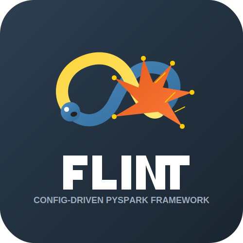

<p align="center">
  
</p>

<h1 align="center">Flint</h1>

<p align="center">
  <b>A lightweight, extensible framework for configuration-driven data pipelines</b>
</p>

<p align="center">
  <a href="https://pypi.org/project/flint/"></a>
  <a href="https://github.com/krijnvanderburg/config-driven-pyspark-framework/blob/main/LICENSE"></a>
  <a href="https://spark.apache.org/docs/latest/"></a>
</p>

<p align="center">
  <b>Built by Krijn van der Burg for the data engineering community</b>
</p>

<p align="center">
  <a href="https://github.com/krijnvanderburg/config-driven-pyspark-framework/stargazers">⭐ Star this repo</a> •
  <a href="https://github.com/krijnvanderburg/config-driven-pyspark-framework/issues">🐛 Report Issues</a> •
  <a href="https://github.com/krijnvanderburg/config-driven-pyspark-framework/discussions">💬 Join Discussions</a>
</p>

<p align="center">
  <a href="https://github.com/krijnvanderburg/config-driven-pyspark-framework/releases">📥 Releases (TBD)</a> •
  <a href="https://github.com/krijnvanderburg/config-driven-pyspark-framework/blob/main/CHANGELOG.md">📝 Changelog (TBD)</a> •
  <a href="https://github.com/krijnvanderburg/config-driven-pyspark-framework/blob/main/CONTRIBUTING.md">🤝 Contributing</a>
</p>

---

Flint transforms data engineering by shifting from custom code to declarative configuration for complete ETL pipeline workflows. The framework handles all execution details while you focus on what your data should do, not how to implement it.

This configuration-driven approach standardizes pipeline patterns across teams, reduces complexity for ETL jobs, improves maintainability, and makes data workflows accessible to users with limited programming experience.

## ⚡ Quick Start

### Installation
```bash
# Clone the repository
git clone https://github.com/krijnvanderburg/config-driven-pyspark-framework.git
cd config-driven-pyspark-framework

# Install dependencies
poetry install
```

### Run an example pipeline
```bash
python -m flint run \
  --alert-filepath="examples/join_select/alert.jsonc" \
  --runtime-filepath="examples/join_select/job.jsonc"
```

## 🔍 Example: Customer Order Analysis
Running this command executes a complete pipeline that showcases Flint's key capabilities:

- **Multi-format extraction**: Seamlessly reads from both CSV and JSON sources
  - Source options like delimiters and headers are configurable through the configuration file
  - Schema validation ensures data type safety and consistency across all sources

- **Flexible transformation chain**: Performed in order as given
  - First a `join` to combine both datasets on `customer_id`
  - Then applies a `select` transform to project only needed columns
  - Each transform function can be easily customized through its arguments

- **Configurable loading**: Writes results as CSV with customizable settings
  - Easily change to Parquet, Delta, or other formats by modifying `data_format`
  - Output mode (overwrite/append) controlled by a simple parameter
  - Output to multiple formats or locations by creating another load entry

#### Configuration: examples/join_select/job.jsonc
```jsonc
{
    "runtime": {
        "id": "customer-orders-pipeline",
        "description": "ETL pipeline for processing customer orders data",
        "enabled": true,
        "jobs": [
            {
                "id": "bronze",
                "description": "",
                "enabled": true,
                "engine_type": "spark", // Specifies the processing engine to use
                "extracts": [
                    {
                        "id": "extract-customers",
                        "extract_type": "file", // Read from file system
                        "data_format": "csv", // CSV input format
                        "location": "examples/join_select/customers/", // Source directory
                        "method": "batch", // Process all files at once
                        "options": {
                            "delimiter": ",", // CSV delimiter character
                            "header": true, // First row contains column names
                            "inferSchema": false // Use provided schema instead of inferring
                        },
                        "schema": "examples/join_select/customers_schema.json" // Path to schema definition
                    },
                    {
                        "id": "extract-orders",
                        "extract_type": "file",
                        "data_format": "json", // JSON input format
                        "location": "examples/join_select/orders/",
                        "method": "batch",
                        "options": {
                            "multiLine": true, // Each JSON object may span multiple lines
                            "inferSchema": false // Use provided schema instead of inferring
                        },
                        "schema": "examples/join_select/orders_schema.json"
                    }
                ],
                "transforms": [
                    {
                        "id": "transform-join-orders",
                        "upstream_id": "extract-customers", // First input dataset from extract stage
                        "options": {},
                        "functions": [
                            {
                                "function_type": "join", // Join customers with orders
                                "arguments": { 
                                    "other_upstream_id": "extract-orders", // Second dataset to join
                                    "on": ["customer_id"], // Join key
                                    "how": "inner" // Join type (inner, left, right, full)
                                }
                            },
                            {
                                "function_type": "select", // Select only specific columns
                                "arguments": {
                                    "columns": ["name", "email", "signup_date", "order_id", "order_date", "amount"]
                                }
                            }
                        ]
                    }
                ],
                "loads": [
                    {
                        "id": "load-customer-orders",
                        "upstream_id": "transform-join-orders", // Input dataset for this load
                        "load_type": "file", // Write to file system
                        "data_format": "csv", // Output as CSV
                        "location": "examples/join_select/output", // Output directory
                        "method": "batch", // Write all data at once
                        "mode": "overwrite", // Replace existing files if any
                        "options": {
                            "header": true // Include header row with column names
                        },
                        "schema_export": "" // No schema export
                    }
                ],
                "hooks": {
                    "onStart": [], // Actions to execute before pipeline starts
                    "onFailure": [], // Actions to execute if pipeline fails
                    "onSuccess": [], // Actions to execute if pipeline succeeds
                    "onFinally": [] // Actions to execute after pipeline completes (success or failure)
                }
            }
        ]
    }
}
```

## 🚀 Getting Help
- **Examples**: Explore working samples in the examples directory
- **Documentation**: Refer to the Configuration Reference section for detailed syntax
- **Community**: Ask questions and report issues on [GitHub Issues](https://github.com/krijnvanderburg/config-driven-pyspark-framework/issues)
- **Source Code**: Browse the implementation in the src/flint directory

## 🤝 Contributing
Contributions are welcome! Feel free to submit a pull request and message me.

## 📄 License
This project is licensed under the Creative Commons Attribution 4.0 International License (CC-BY-4.0) - see the LICENSE file for details.
