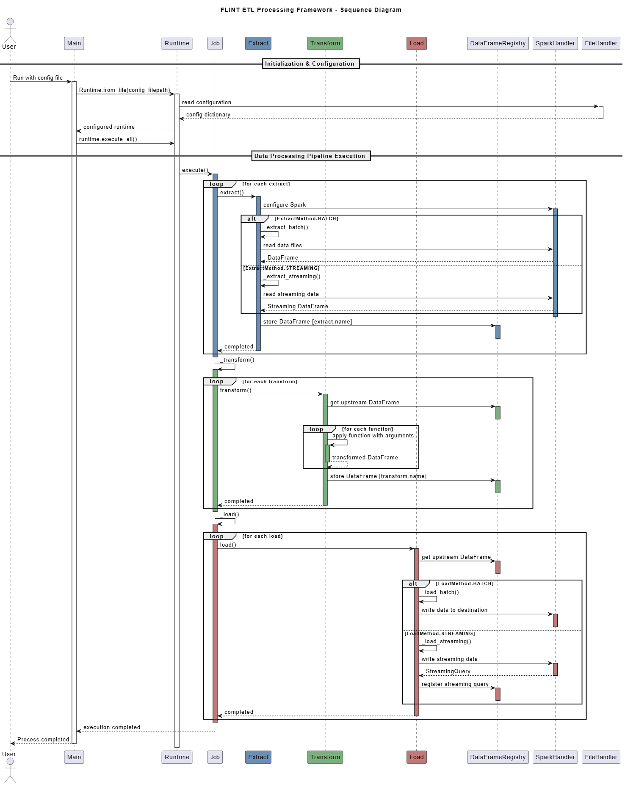

# Flint - Config Driven Pyspark Framework

## Overview

Flint is a config-driven ETL (Extract, Transform, Load) framework built on Apache Spark. It enables data engineers to define complex data pipelines through declarative configuration files rather than writing extensive code, reducing development time and promoting standardization across teams.

The framework follows a "configuration as code" philosophy, allowing for version-controlled, easily reviewable data pipelines that separate the business logic from implementation details.

## Key Features

- **Declarative Configuration**: Define entire ETL pipelines using JSON or YAML configuration files
- **Modular Architecture**: Cleanly separated extract, transform, and load components
- **Extensible Transform System**: Easily add custom transformations through a plugin registry
- **Batch & Streaming Support**: Process data in batch or streaming mode using the same framework

## Benefits

- **Reduced Development Time**: Create new data pipelines with minimal code
- **Standardization**: Enforce consistent approaches to data processing across teams
- **Maintainability**: Declarative configs make pipelines easier to understand and modify
- **Reusability**: Common transformations can be shared across multiple pipelines
- **Type Safety**: Strongly-typed models ensure configuration correctness
- **Separation of Concerns**: Data engineers focus solely on data logic, not implementation details


## Getting Started

### Quick Start Example

1. Create a configuration file (e.g., `job.json`):

```json
{
  "extracts": [
    {
      "name": "extract-customers",
      "method": "batch",
      "data_format": "csv",
      "location": "path/to/customers.csv",
      "schema": "path/to/schema.json",
      "options": {
        "header": true,
        "delimiter": ","
      }
    }
  ],
  "transforms": [
    {
      "name": "transform-customers",
      "upstream_name": "extract-customers",
      "functions": [
        {
          "function": "select",
          "arguments": {
            "columns": ["customer_id", "name", "email"]
          }
        }
      ]
    }
  ],
  "loads": [
    {
      "name": "load-customers",
      "method": "batch",
      "data_format": "parquet",
      "location": "path/to/output/",
      "upstream_name": "transform-customers",
      "mode": "overwrite",
      "options": {}
    }
  ]
}
```

2. Execute the pipeline:

```bash
python -m flint --config-filepath examples/job.json
```

### Available Transformations

Flint comes with several built-in transformations:

| Transform | Description |
|-----------|-------------|
| `customer_orders_bronze` | Example Join customer and order data with filtering |
| `select` | Generic select specific columns from a DataFrame |
| `calculate_birth_year` | Generic calculate birth year based on age |

## Configuration Reference

### Extract Configuration

```json
{
  "name": "extract-name",
  "method": "batch|stream",
  "data_format": "csv|json|parquet|...",
  "location": "path/to/source",
  "schema": "path/to/schema.json",
  "options": {
    "header": true,
    "delimiter": ",",
    "inferSchema": false
    // Other format-specific options
  }
}
```

### Transform Configuration

```json
{
  "name": "transform-name",
  "upstream_name": "previous-step-name",
  "functions": [
    {
      "function": "transform-function-name",
      "arguments": {
        // Function-specific arguments
      }
    }
  ]
}
```

### Load Configuration

```json
{
  "name": "load-name",
  "upstream_name": "previous-step-name",
  "method": "batch|stream",
  "data_format": "csv|json|parquet|...",
  "location": "path/to/destination",
  "mode": "overwrite|append|ignore|error",
  "options": {
    // Format-specific options
  }
}
```

## Architecture

Flint is built with a registry-based architecture that dynamically matches different data formats and operations to their implementations. This allows for extension without modifying existing code.

The framework parses configuration files into strongly-typed models that define pipeline behavior. Each job starts with Extract components that read data from various sources, passes the data through Transform components that apply business logic, and finishes with Load components that write results to target destinations.

DataFrames flow through the pipeline via a singleton registry that maintains references by name, enabling multi-step transformations. This design separates configuration from implementation, making pipelines flexible and maintainable while leveraging Spark's distributed processing capabilities.

### Pipeline Flow

1. **Configuration Parsing**: JSON/YAML files are parsed into typed models
2. **Extract Phase**: Data is read from source systems into DataFrames
3. **Transform Phase**: Business logic is applied through registered transform functions
4. **Load Phase**: Processed data is written to destination systems
5. **Execution**: The job orchestrates the flow between these components

### Sequence Diagram



### Class Diagram


## Extending the Framework

### Creating a Custom Transform

1. Create a model in `src/flint/models/transforms/`
2. Create a transformer class in `src/flint/core/transforms/` and register it:

```python
from pyspark.sql import DataFrame
from flint.core.transform import Function, TransformFunctionRegistry
from flint.models.transforms.your_model import YourFunctionModel

@TransformFunctionRegistry.register("your_transform_name")
class YourTransformFunction(Function[YourFunctionModel]):
    model_cls = YourFunctionModel

    def transform(self):
        def __f(df: DataFrame) -> DataFrame:
            # Your transformation logic here
            return transformed_df
        return __f
```

## Examples

The [examples/](examples/) directory contains sample configurations and use cases to help you get started:

- `examples/job.json` - Basic example joining customer and order data
- `examples/customer_orders/` - Sample data files and schemas

## Contributing

Contributions are welcome! Please feel free to submit a Pull Request.
