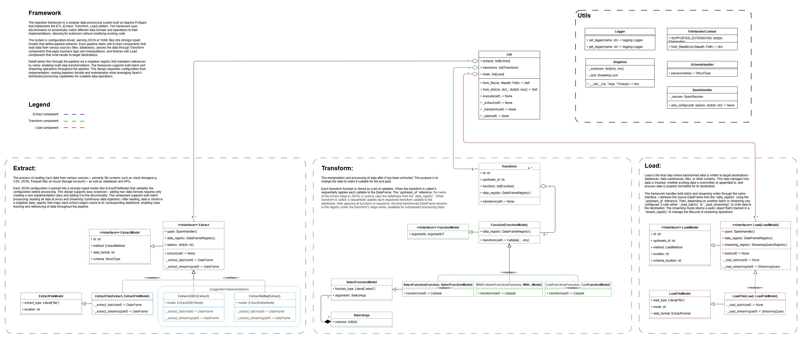

<p align="center">
  
</p>

<h1 align="center">Flint</h1>

<p align="center">
  <b>Build PySpark ETL pipelines with the ultimate extensible framework</b>
</p>

<p align="center">
  <a href="https://pypi.org/project/flint/"></a>
  <a href="https://github.com/krijnvanderburg/config-driven-pyspark-framework/blob/main/LICENSE"></a>
</p>

---

## 🔍 Overview

**Flint is a barebones, logical framework for Apache Spark** that eliminates repetitive code through a declarative, configuration-driven approach.

The core philosophy is simple: provide a clean, intuitive structure that lets teams easily create and share their own transformations. No complex abstractions—just a logical framework that makes PySpark development straightforward and maintainable.

Flint was designed to be **minimal yet powerful** - giving you the structural foundations while letting your team extend it with your own business-specific transforms.

Data teams waste countless hours writing and maintaining boilerplate Spark code. Flint solves this by letting you define complete ETL workflows with simple JSON/YAML files.

### Build pipelines that are:

✅ **Version-controlled** - More easily track changes by inspecting one config file  
✅ **Maintainable** - Clear separation of business logic and implementation details  
✅ **Standardized** - Consistent patterns across your organization

No more writing repetitive, error-prone Spark code. Flint lets you focus on data transformations while handling the application structure complexities.


## ⚡ Quick Start

### Installation

```bash
git clone https://github.com/krijnvanderburg/config-driven-pyspark-framework.git
cd config-driven-pyspark-framework
poetry install
```

### Running the Example Pipeline

Try the included example that joins customer and order data:

```bash
python -m flint --config-filepath examples/job.json
```

### Example
The [examples/](examples/) directory contains sample configurations and data files:
- `examples/job.json` - Basic example joining customer and order data
- `examples/customer_orders/` - Sample data files and schemas

The benefits:

- **Multi-format extraction**: Seamlessly reads from both CSV and JSON sources
  - Source options like delimiters and headers are easily configurable
  - Schema validation ensures type safety for both sources

- **Flexible transformation chain**: Combines domain-specific and generic transforms
  - First uses a custom `customers_orders_bronze` transform to join datasets and filter orders > $100
  - Then applies the generic `select` transform to project only needed columns
  - Each transform function can be easily customized through its arguments

- **Configurable loading**: Writes results as CSV with customizable settings
  - Easily change to Parquet, Delta, or other formats by modifying `data_format`
  - Output mode (overwrite/append) controlled by a simple parameter

To run this example:

```bash
python -m flint --config-filepath examples/job.json
```

Checkout the `examples/output/` folder for the result.

```json
{
    "extracts": [
        {
            "data_format": "csv",
            "location": "examples/customer_orders/customers.csv",
            "method": "batch",
            "name": "extract-customers",
            "options": {
                "delimiter": ",",
                "header": true,
                "inferSchema": false
            },
            "schema": "examples/customer_orders/customers_schema.json"
        },
        {
            "data_format": "json",
            "location": "examples/customer_orders/orders.json",
            "method": "batch",
            "name": "extract-orders",
            "options": {},
            "schema": "examples/customer_orders/orders_schema.json"
        }
    ],
    "transforms": [
        {
            "name": "transform-join-orders",
            "upstream_name": "extract-customers",
            "functions": [
                { "function": "customers_orders_bronze", "arguments": {"filter_amount": 100} },
                { "function": "select", "arguments": {"columns": ["name", "email", "signup_date", "order_id", "order_date", "amount"]} }
            ]
        }
    ],
    "loads": [
        {
            "name": "load-customer-orders",
            "upstream_name": "transform-join-orders",
            "data_format": "csv",
            "location": "examples/customer_orders/output",
            "method": "batch",
            "mode": "overwrite",
            "options": {}
        }
    ]
}
```


### Built-in Transformations

Flint comes with several example transformations, from generic transform functionality to an example source specific business logic:

| Transform | Description |
|-----------|-------------|
| `select` | Generic Select specific columns from a DataFrame. |
| `calculate_birth_year` | Calculate birth year based on age. |
| `customer_orders_bronze` | Example join customer and order data with filtering. |

## 📋 Configuration Reference

### Full Schema Structure

A Flint pipeline consists of three main components working together:

```
Configuration
├── Extracts - Read data from source systems
├── Transforms - Apply business logic
└── Loads - Write data to destination systems
```

Each component is configured through a specific schema:

<details>
<summary><b>Extract Configuration</b></summary>

```json
{
  "name": "extract-name",                    // Required: Unique identifier
  "method": "batch|stream",                  // Required: Processing method
  "data_format": "csv|json|parquet|...",     // Required: Source format
  "location": "path/to/source",              // Required: Source location
  "schema": "path/to/schema.json",           // Optional: Schema definition
  "options": {                               // Optional: Format-specific options
    "header": true,
    "delimiter": ",",
    "inferSchema": false
  }
}
```

**Supported Formats:** CSV, JSON, Parquet, Avro, ORC, Text, JDBC, Delta (with appropriate dependencies)
</details>

<details>
<summary><b>Transform Configuration</b></summary>

```json
{
  "name": "transform-name",                  // Required: Unique identifier
  "upstream_name": "previous-step-name",     // Required: Input data source
  "functions": [                             // Required: List of transformations
    {
      "function": "transform-function-name", // Required: Registered function name
      "arguments": {                         // Required: Function-specific arguments
        "key1": "value1",
        "key2": "value2"
      }
    }
  ]
}
```

**Function Application:** Transformations are applied in sequence, with each function's output feeding into the next.
</details>

<details>
<summary><b>Load Configuration</b></summary>

```json
{
  "name": "load-name",                       // Required: Unique identifier
  "upstream_name": "previous-step-name",     // Required: Input data source
  "method": "batch|stream",                  // Required: Processing method
  "data_format": "csv|json|parquet|...",     // Required: Destination format
  "location": "path/to/destination",         // Required: Output location
  "mode": "overwrite|append|ignore|error",   // Required: Write mode
  "options": {                               // Optional: Format-specific options
    "compression": "snappy",
    "partitionBy": ["column1", "column2"]
  }
}
```

**Modes explained:**
- `overwrite`: Replace existing data
- `append`: Add to existing data
- `ignore`: Ignore operation if data exists
- `error`: Fail if data already exists
</details>


### Data Flow

1. **Parse Configuration** → Validate and convert JSON/YAML into typed models
2. **Initialize Components** → Set up extract, transform, and load objects
3. **Execute Pipeline** → Process data through the configured workflow
4. **Monitor & Log** → Track execution and handle errors


### Key Components

- **Registry System**: Central repository that manages registered components and data frames
- **Type Models**: Strongly-typed configuration models providing compile-time validation
- **Function Framework**: Plugin system for custom transformations
- **Execution Engine**: Coordinates the pipeline flow and handles dependencies

<details>
<summary><b>Class Structure</b></summary>



- **Job**: Orchestrates the entire pipeline execution
- **Extract**: Reads data from various sources into DataFrames
- **Transform**: Applies business logic through registered functions
- **Load**: Writes processed data to destination systems
</details>

### Design Principles

- **Separation of Concerns**: Each component has a single, well-defined responsibility
- **Dependency Injection**: Components receive their dependencies rather than creating them
- **Plugin Architecture**: Extensions are registered with the framework without modifying core code
- **Configuration as Code**: All pipeline behavior is defined declaratively in configuration files

## 🧩 Extending with Custom Transforms

Flint's power comes from its extensibility. Create custom transformations to encapsulate your business logic. Let's look at a real example from Flint's codebase - the `select` transform:

### Step 1: Define the configuration model

```python
# src/flint/models/transforms/model_select.py

@dataclass
class SelectFunctionModel(FunctionModel):

    function: str
    arguments: "SelectFunctionModel.Args"

    @dataclass
    class Args:
        columns: list[Column]

    @classmethod
    def from_dict(cls, dict_: dict[str, Any]) -> Self:
        try:
            function_name = dict_[FUNCTION]
            arguments_dict = dict_[ARGUMENTS]

            # Process the arguments
            columns = []
            for col_name in arguments_dict[COLUMNS]:
                columns.append(f.col(col_name))

            arguments = cls.Args(columns=columns)

        except KeyError as e:
            raise DictKeyError(key=e.args[0], dict_=dict_) from e

        return cls(function=function_name, arguments=arguments)
```

### Step 2: Create the transform function

```python
# src/flint/core/transforms/select.py

@TransformFunctionRegistry.register("select")
class SelectFunction(Function[SelectFunctionModel]):
    model_cls = SelectFunctionModel

    def transform(self) -> Callable:
        def __f(df: DataFrame) -> DataFrame:
            return df.select(*self.model.arguments.columns)

        return __f
```

### Step 3: Use in your pipeline configuration

```json
{
  "transforms": [
    {
      "name": "transform-user-data",
      "upstream_name": "extract-users",
      "functions": [
        { "function": "select", "arguments": { "columns": ["user_id", "email", "signup_date"] } }
      ]
    }
  ]
}
```

> 🔍 **Best Practice**: Create transforms that are generic enough to be reusable but specific enough to encapsulate meaningful business logic.

### Building a Transform Library

As your team develops more custom transforms, you create a powerful library of reusable components:

1. **Domain-Specific Transforms**: Create transforms that encapsulate your business rules
2. **Industry-Specific Logic**: Build transforms tailored to your industry's specific needs
3. **Data Quality Rules**: Implement your organization's data quality standards

The registration system makes it easy to discover and use all available transforms in your configurations without modifying the core framework code.


## 🚀 Getting Help

- Check out the [examples/](examples/) directory for working samples
- Read the [Configuration Reference](#-configuration-reference) for detailed syntax
- Visit our [GitHub Issues](https://github.com/krijnvanderburg/config-driven-pyspark-framework/issues) page for support

## 🤝 Contributing

Contributions are welcome! Please feel free to submit a Pull Request.

## 📄 License

This project is licensed under the CC-BY-4.0 License - see the [LICENSE](LICENSE) file for details.


---
<br>
<p align="center">
  <b>Built by Krijn van der Burg for the data engineering community</b>
</p>

<p align="center">
  <a href="https://github.com/krijnvanderburg/config-driven-pyspark-framework/stargazers">⭐ Star us on GitHub</a> •
  <a href="https://github.com/krijnvanderburg/config-driven-pyspark-framework/issues">🐛 Report Issues</a> •
  <a href="https://github.com/krijnvanderburg/config-driven-pyspark-framework/discussions">💬 Join Discussions</a>
</p>

<p align="center">
  <a href="https://github.com/krijnvanderburg/config-driven-pyspark-framework/releases">📥 Releases (TBD)</a> •
  <a href="https://github.com/krijnvanderburg/config-driven-pyspark-framework/blob/main/CHANGELOG.md">📝 Changelog (TBD)</a> •
  <a href="https://github.com/krijnvanderburg/config-driven-pyspark-framework/blob/main/CONTRIBUTING.md">🤝 Contributing (TBD)</a>
</p>