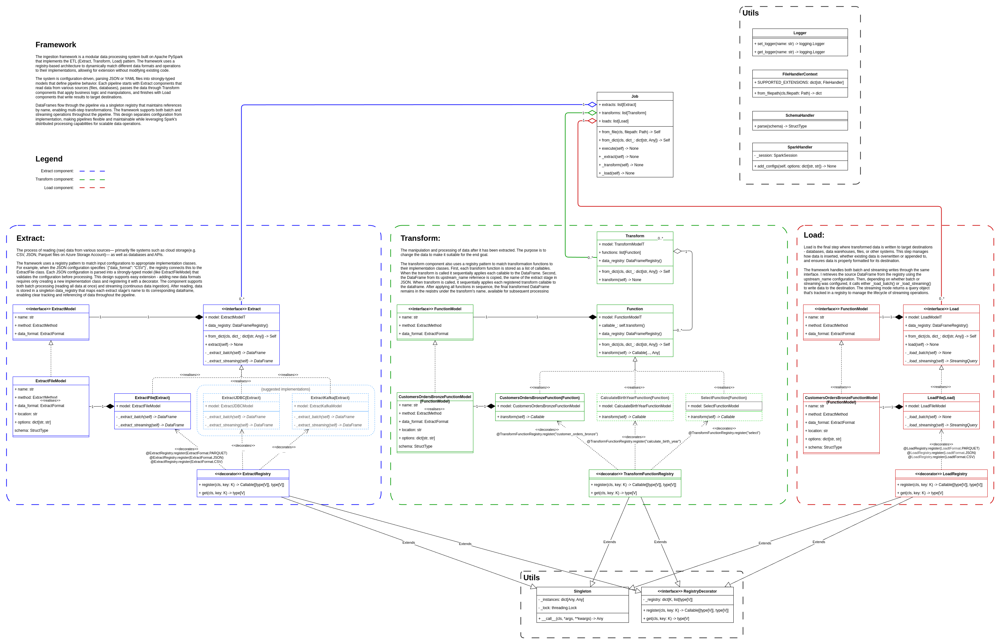

# Data Ingestion Framework


## Overview

The Data Ingestion Framework is a robust, configurable ETL (Extract, Transform, Load) solution built on Apache Spark. It provides a declarative approach to data pipelines, allowing engineers to define complex data workflows through configuration rather than code.


## Key Features

- **Declarative Configuration**: Define entire ETL pipelines using JSON configuration files
- **Modular Architecture**: Cleanly separated extract, transform, and load components
- **Extensible Transforms**: Easily add custom extract, transformation, and load logic through a plugin system

## Benefits

- **Reduced Development Time**: Create new data pipelines with minimal code
- **Standardization**: Enforce consistent approaches to data processing across teams
- **Maintainability**: Declarative configs make pipelines easier to understand and modify
- **Reusability**: Common transformations can be shared across multiple pipelines

## Getting Started

### Quick Start Example

1. Create a configuration file (e.g., `job.json`):

```json
{
  "extracts": [
    {
      "name": "extract-customers",
      "method": "batch",
      "data_format": "csv",
      "location": "path/to/customers.csv",
      "schema": "path/to/schema.json",
      "options": {
        "header": true
      }
    }
  ],
  "transforms": [
    {
      "name": "transform-customers",
      "upstream_name": "extract-customers",
      "functions": [
        {
          "function": "select",
          "arguments": {
            "columns": ["customer_id", "name", "email"]
          }
        }
      ]
    }
  ],
  "loads": [
    {
      "name": "load-customers",
      "method": "batch",
      "data_format": "parquet",
      "location": "path/to/output/",
      "upstream_name": "transform-customers",
      "options": {
        "mode": "overwrite"
      }
    }
  ]
}
```

2. Execute the pipeline:

```bash
python -m ingestion_framework --config-filepath path/to/job.json
```

## Architecture
This framework is a modular data processing system built on Apache PySpark that implements the ETL (Extract, Transform, Load) pattern. The framework uses a registry-based architecture to dynamically match different data formats and operations to their implementations, allowing for extension without modifying existing code.

The system is configuration-driven, parsing JSON or YAML files into strongly-typed models that define pipeline behavior. Each pipeline starts with Extract components that read data from various sources (files, databases), passes the data through Transform components that apply business logic and manipulations, and finishes with Load components that write results to target destinations.

DataFrames flow through the pipeline via a singleton registry that maintains references by name, enabling multi-step transformations. The framework supports both batch and streaming operations throughout the pipeline. This design separates configuration from implementation, making pipelines flexible and maintainable while leveraging Spark's distributed processing capabilities for scalable data operations.



The diagram above illustrates the modular architecture of the Data Ingestion Framework, showing the flow of data through extract, transform, and load components.

## Examples

The [examples/](examples/) directory contains sample configurations and use cases to help you get started.

## Contributing

Contributions are welcome! Please feel free to connect or submit a Pull Request.

## License

This project is licensed under the MIT License - see the LICENSE file for details.
