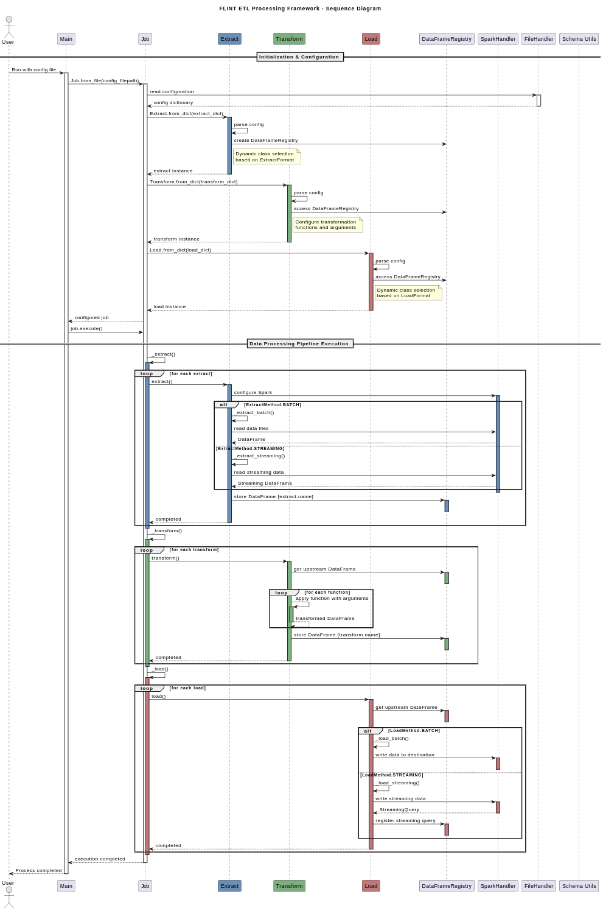
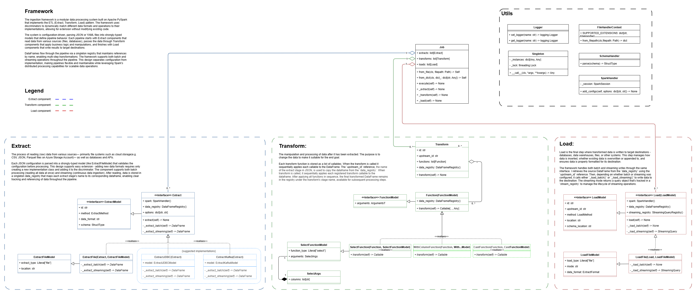

<!-- filepath: architecture.md -->
# Architecture

This document explains Flint's architecture and execution flow, helping you understand how configuration files translate into data processing pipelines.

<!-- filepath: architecture.md -->
<!-- filepath: architecture.md -->
## Design Principles
The software adheres to these core design principles:

- **Type Safety** — Configurations are validated against strongly-typed models
  - Configuration errors are caught before execution
  - Runtime type errors are minimized
  - IDE tooling can provide autocompletion and validation
- **Agnosticism** — Same configuration works across different processing backends
  - Pipeline definitions independent of execution engine
  - Support for multiple engines (Spark, Polars, etc.)
  - Migration between engines without rewriting pipelines
- **Composability** — Pipeline components can be assembled in various combinations
  - Components reference each other by ID
  - Complex pipelines built from simple building blocks
  - Reuse of common components across multiple pipelines
- **Separation of Concerns** — Each component has a single, well-defined responsibility
  - Extract components focus solely on data sourcing
  - Transform components handle only data manipulation
  - Load components manage just data writing operations
- **Idempotency** — Pipeline executions produce consistent results with repeated runs
  - Deterministic transformations
  - Configurable write modes (overwrite, append, etc.)
  - Handling of duplicate data
- **Extensibility** — Framework can be extended without modifying core functionality
  - Custom transforms via the function framework
  - Custom alert channels through the notification system
  - Event hooks for custom actions during pipeline execution

## Pipeline Execution Flow
The execution of a Flint pipeline follows this sequence:

1. **Parse Configuration** — Convert JSON/YAML configurations into typed models with validation
2. **Initialize Components** — Set up extract, transform, and load objects based on configuration
3. **Execute Pipeline** — Process data through the configured workflow in sequence



*Figure: Sequence diagram showing the Flint pipeline execution flow (Extract → Transform → Load).*

## Class Diagram


The core components work together:
- **Job** — Orchestrates the entire pipeline execution
    - **Extract** — Reads data from various sources into DataFrames
    - **Transform** — Applies business transform logic through registered functions
    - **Load** — Writes processed data to destination


## Extending with Custom Transforms

Flint's power comes from its extensibility. Create custom transformations to encapsulate your business logic. Here's a real example from Flint's codebase - the select transform:

### Step 1: Define the configuration model

```python
# src/flint/models/transforms/model_select.py

@dataclass
class SelectFunctionModel(FunctionModel):
    function: str  # Name of the function
    arguments: "SelectFunctionModel.Args"  # Arguments for the function

    @dataclass
    class Args:
        columns: list[Column]  # List of columns to select

    @classmethod
    def from_dict(cls, dict_: dict[str, Any]) -> Self:
        """Convert JSON configuration to typed model."""
        function_name = dict_[FUNCTION]
        arguments_dict = dict_[ARGUMENTS]
        
        columns = arguments_dict["columns"]
        arguments = cls.Args(columns=columns)
        
        return cls(function=function_name, arguments=arguments)
```

### Step 2: Create the transform function

```python
# src/flint/core/transforms/select.py

@TransformFunctionRegistry.register("select")
class SelectFunction(Function[SelectFunctionModel]):
    """Selects specified columns from a DataFrame."""
    model_cls = SelectFunctionModel

    def transform(self) -> Callable:
        """Returns a function that projects columns from a DataFrame."""
        def __f(df: DataFrame) -> DataFrame:
            return df.select(*self.model.arguments.columns)

        return __f
```

### Step 3: Use in your pipeline configuration

```json
{
  "extracts": [
    // ...
  ],
  "transforms": [
    {
      "name": "transform-user-data",
      "upstream_name": "extract-users",
      "functions": [
        { "function": "select", "arguments": { "columns": ["user_id", "email", "signup_date"] } }
      ]
    }
  ],
  "loads": [
    // ...
  ]
}
```
> **Best Practice**: Create transforms that are generic enough to be reusable but specific enough to encapsulate meaningful business logic.
