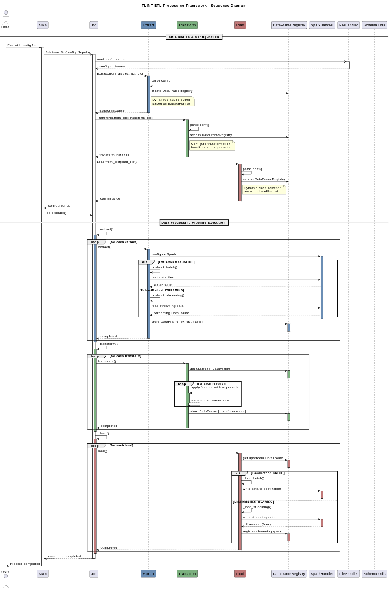
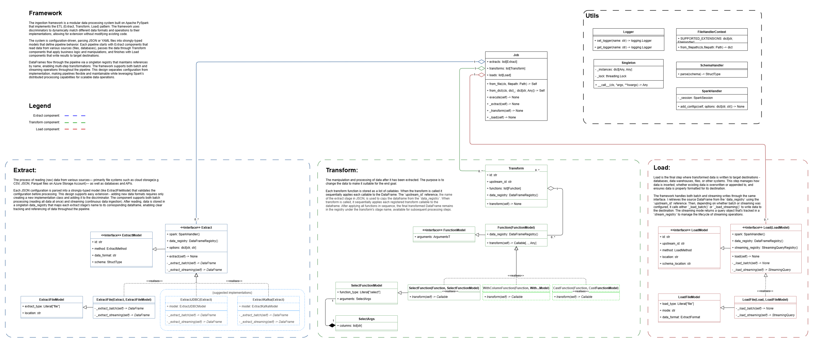

# Architecture

This document explains Samara's architecture and execution flow, helping you understand how configuration files translate into data processing pipelines.

## Design Principles
Samara adheres to these core design principles:

- **Type Safety** — Configurations are validated against strongly-typed models
  - Configuration errors are caught before execution
  - Workflow type errors are minimized
  - IDE tooling can provide autocompletion and validation
- **Agnosticism** — Same configuration works across different processing backends
  - Pipeline definitions independent of execution engine
  - Support for multiple engines (Spark, Polars, etc.)
  - Migration between engines without rewriting pipelines
- **Composability** — Pipeline components can be assembled in various combinations
  - Components reference each other by ID
  - Complex pipelines built from simple building blocks
  - Reuse of common components across multiple pipelines
- **Separation of Concerns** — Each component has a single, well-defined responsibility
  - Extract components focus solely on data sourcing
  - Transform components handle only data manipulation
  - Load components manage just data writing operations
- **Idempotency** — Pipeline executions produce consistent results with repeated runs
  - Deterministic transformations
  - Configurable write modes (overwrite, append, etc.)
  - Handling of duplicate data
- **Extensibility** — Framework can be extended without modifying core functionality
  - Custom transforms via the function framework
  - Custom alert channels through the notification system
  - Event hooks for custom actions during pipeline execution

## Pipeline Execution Flow
The execution of a Samara pipeline follows this sequence:

1. **Parse Configuration** — Convert JSON/YAML configurations into typed models with validation
2. **Initialize Components** — Set up extract, transform, and load objects based on configuration
3. **Execute Pipeline** — Process data through the configured workflow in sequence



*Figure: Sequence diagram showing the Samara pipeline execution flow (Extract → Transform → Load).*

## Class Diagram


The core components work together:
- **Job** — Orchestrates the entire pipeline execution
    - **Extract** — Reads data from various sources into DataFrames
    - **Transform** — Applies business transform logic through registered functions
    - **Load** — Writes processed data to destination


## Extending with Custom Transforms

Samara's power comes from its extensibility. Create custom transformations to encapsulate your business logic. Here's a walkthrough using the select transform from Samara's codebase:

### Step 1: Define the configuration model

Define a Pydantic model that validates the configuration for your transform:

```python
# src/samara/workflow/jobs/models/transforms/model_select.py

from typing import Literal
from pydantic import Field
from samara.workflow.jobs.models.model_transform import ArgsModel

class SelectArgs(ArgsModel):
    """Arguments for column selection."""
    columns: list[str] = Field(..., description="Columns to select", min_length=1)

class SelectFunctionModel:
    """Configuration model for column selection."""
    function_type: Literal["select"] = "select"
    arguments: SelectArgs = Field(..., description="Column selection parameters")
```

### Step 2: Create the transform function

Implement the transform by inheriting from both the model and the engine-specific base class:

```python
# src/samara/workflow/jobs/spark/transforms/select.py

from collections.abc import Callable
from pyspark.sql import DataFrame
from samara.workflow.jobs.models.transforms.model_select import SelectFunctionModel
from samara.workflow.jobs.spark.transforms.base import FunctionSpark

class SelectFunction(SelectFunctionModel, FunctionSpark):
    """Project specific columns from a DataFrame."""

    def transform(self) -> Callable:
        """Returns a function that projects columns from a DataFrame."""
        def __f(df: DataFrame) -> DataFrame:
            return df.select(*self.arguments.columns)
        return __f
```

### Step 3: Use in your pipeline configuration

```jsonc
{
  "transforms": [
    {
      "id": "transform-user-data",
      "upstream_id": "extract-users",
      "functions": [
        { "function_type": "select", "arguments": { "columns": ["user_id", "email", "signup_date"] } }
      ]
    }
  ]
}
```
> **Best Practice**: Create transforms that are generic enough to be reusable but specific enough to encapsulate meaningful business logic.
